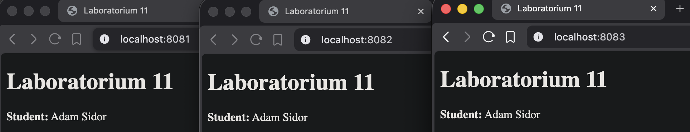

# Sprawozdanie z Laboratorium 11

## Treść pliku `index.html`

Plik `index.html` został przygotowany w katalogu roboczym `/Lab11` i zawiera wymagane informacje:

```html
<!DOCTYPE html>
<html lang="pl">

<head>
    <meta charset="UTF-8">
    <title>Laboratorium 11</title>
</head>

<body>
    <h1>Laboratorium 11</h1>
    <p><strong>Student:</strong> Adam Sidor</p>
</body>

</html>
```

---

## Kroki wykonania i logi z terminala

### 1. Przygotowanie struktury katalogów i sieci mostkowej `lab11net`

W katalogu roboczym `Lab11` utworzono katalogi dedykowane na logi:
```bash
adam@Adams-MacBook-Pro Lab11 % mkdir web1 web2 web3
```

Następnie utworzono sieć mostkową o nazwie `lab11net`:
```text
adam@Adams-MacBook-Pro Lab11 % docker network create --driver bridge lab11net

1acf39144e42384d9823e7e6e42a6d4a17517e69c0d8394285609118b190a59f
```

---

### 2. Uruchomienie kontenerów z mapowaniem portów i wolumenów

Wszystkie trzy kontenery zostały uruchomione z obrazu `nginx:latest`. Porty zewnętrzne dla hosta zostały zmapowane kolejno na:
* `8081` dla `web1`
* `8082` dla `web2`
* `8083` dla `web3`

Do każdego kontenera podłączono plik `index.html` w trybie tylko do odczytu (`:ro`) oraz odpowiedni podkatalog na logi.

Uruchamianie kontenera 1:
```text
adam@Adams-MacBook-Pro Lab11 % docker run -d \
  --name web1 \
  --network lab11net \
  -p 8081:80 \
  -v ./index.html:/usr/share/nginx/html/index.html:ro \
  -v ./web1:/var/log/nginx \
  nginx:latest

Unable to find image 'nginx:latest' locally
latest: Pulling from library/nginx
9ebf9a1d0c9c: Pull complete 
7478430a6158: Pull complete 
2d8bf65037c1: Pull complete 
c905d9770386: Pull complete 
ea1577bf1697: Pull complete 
0db0a38017b0: Pull complete 
8f08c23c03cd: Pull complete 
Digest: sha256:06aa3d7be10bc6307990c81bdca075793132e9163391abc370c015e344e23128
Status: Downloaded newer image for nginx:latest
38171ca46b331187f2a8b1b610020fe9354b1baadb68f473736deac2d1949ac8
```

Uruchamianie kontenera 2:
```text
adam@Adams-MacBook-Pro Lab11 % docker run -d \
  --name web2 \
  --network lab11net \
  -p 8082:80 \
  -v ./index.html:/usr/share/nginx/html/index.html:ro \
  -v ./web2:/var/log/nginx \
  nginx:latest

cc574685d88dd04a7c7279fbdc4fae677d3866db6b28424fde3cc06a312ebead
```

Uruchamianie kontenera 3:
```text
adam@Adams-MacBook-Pro Lab11 % docker run -d \
  --name web3 \
  --network lab11net \
  -p 8083:80 \
  -v ./index.html:/usr/share/nginx/html/index.html:ro \
  -v ./web3:/var/log/nginx \
  nginx:latest

9b15f5b02cf737ee822dbf7945b4a3a613f6f6b75e1a359c95d5b05b721f7a8a
```

---

### 3. Potwierdzenie poprawnego działania kontenerów

Poniższy zrzut ekranu przedstawia potwierdzenie poprawnego uruchomienia i działania wszystkich trzech kontenerów:



---

### 4. Weryfikacja działania serwerów oraz poprawności zapisu logów

Po odpytaniu każdego z serwerów poprzez przeglądarkę na hoście (odpowiednio na portach `8081`, `8082` i `8083`), serwery poprawnie obsłużyły ruch, co potwierdza obecność logów dostępowych w lokalnych katalogach projektu.

Poniższe komendy demonstrują zawartość plików logów zebranych z poziomu systemu operacyjnego macOS (hosta), co stanowi bezpośredni dowód na to, że logi są poprawnie zapisywane na dysku komputera macierzystego:

Odczyt logów kontenera 1:
```text
adam@Adams-MacBook-Pro Lab11 % cat web1/access.log
192.168.65.1 - - [19/May/2026:08:22:45 +0000] "GET / HTTP/1.1" 200 212 "-" "Mozilla/5.0 (Macintosh; Intel Mac OS X 10_15_7) AppleWebKit/537.36 (KHTML, like Gecko) Chrome/148.0.0.0 Safari/537.36" "-"
192.168.65.1 - - [19/May/2026:08:22:45 +0000] "GET /favicon.ico HTTP/1.1" 404 555 "http://localhost:8081/" "Mozilla/5.0 (Macintosh; Intel Mac OS X 10_15_7) AppleWebKit/537.36 (KHTML, like Gecko) Chrome/148.0.0.0 Safari/537.36" "-"
```

Odczyt logów kontenera 2:
```text
adam@Adams-MacBook-Pro Lab11 % cat web2/access.log
192.168.65.1 - - [19/May/2026:08:22:52 +0000] "GET / HTTP/1.1" 200 212 "-" "Mozilla/5.0 (Macintosh; Intel Mac OS X 10_15_7) AppleWebKit/537.36 (KHTML, like Gecko) Chrome/148.0.0.0 Safari/537.36" "-"
192.168.65.1 - - [19/May/2026:08:22:53 +0000] "GET /favicon.ico HTTP/1.1" 404 555 "http://localhost:8082/" "Mozilla/5.0 (Macintosh; Intel Mac OS X 10_15_7) AppleWebKit/537.36 (KHTML, like Gecko) Chrome/148.0.0.0 Safari/537.36" "-"
```

Odczyt logów kontenera 3:
```text
adam@Adams-MacBook-Pro Lab11 % cat web3/access.log
192.168.65.1 - - [19/May/2026:08:22:55 +0000] "GET / HTTP/1.1" 200 212 "-" "Mozilla/5.0 (Macintosh; Intel Mac OS X 10_15_7) AppleWebKit/537.36 (KHTML, like Gecko) Chrome/148.0.0.0 Safari/537.36" "-"
192.168.65.1 - - [19/May/2026:08:22:56 +0000] "GET /favicon.ico HTTP/1.1" 404 555 "http://localhost:8083/" "Mozilla/5.0 (Macintosh; Intel Mac OS X 10_15_7) AppleWebKit/537.36 (KHTML, like Gecko) Chrome/148.0.0.0 Safari/537.36" "-"
```