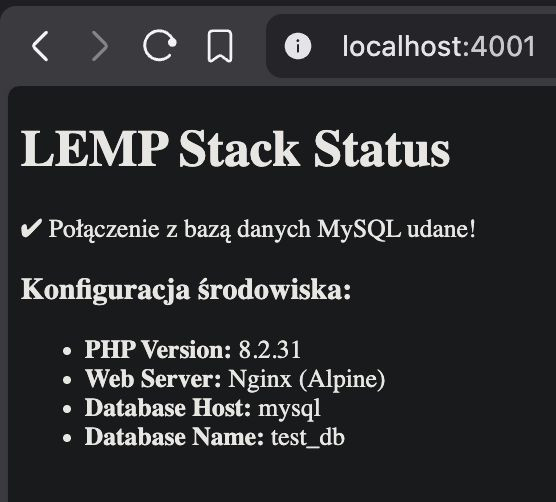
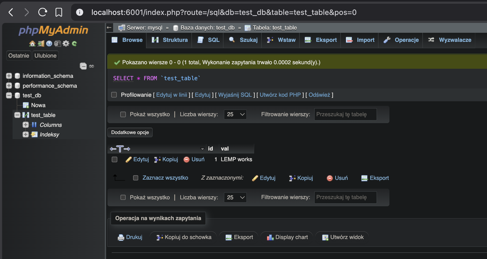

# Sprawozdanie z Laboratorium 12 - Stack LEMP w Docker Compose

## 1. Konfiguracja pliku `docker-compose.yml`

Poniżej znajduje się pełna konfiguracja pliku `docker-compose.yml` realizująca uruchomienie stacka LEMP (Nginx, PHP-FPM, MySQL) wraz z phpMyAdmin:

```yaml
services:
  nginx:
    image: nginx:1.25-alpine
    container_name: nginx_server
    ports:
      - "4001:80"
    volumes:
      - ./nginx/default.conf:/etc/nginx/conf.d/default.conf:ro
      - ./html:/var/www/html:ro
    networks:
      - frontend
      - backend
    depends_on:
      - php

  php:
    image: chialab/php:8.5-fpm
    container_name: php_app
    volumes:
      - ./html:/var/www/html
    networks:
      - backend

  mysql:
    image: mysql:8.0
    container_name: mysql_db
    environment:
      MYSQL_ROOT_PASSWORD: root_password
      MYSQL_DATABASE: test_db
      MYSQL_USER: test_user
      MYSQL_PASSWORD: test_password
    volumes:
      - mysql_data:/var/lib/mysql
    networks:
      - backend

  phpmyadmin:
    image: phpmyadmin:5.2
    container_name: phpmyadmin_ui
    ports:
      - "6001:80"
    environment:
      PMA_HOST: mysql
      MYSQL_ROOT_PASSWORD: root_password
    networks:
      - frontend
      - backend
    depends_on:
      - mysql

volumes:
  mysql_data:

networks:
  frontend:
  backend:
```

---

## 2. Uzasadnienie konfiguracji sieciowej (phpMyAdmin)

W architekturze zdefiniowano dwie izolowane sieci: `frontend` oraz `backend`. 

* **`phpmyadmin`** został przyłączony **zarówno do sieci `frontend`, jak i `backend`**.
* **Uzasadnienie:**
  * Kontener `phpmyadmin` musi komunikować się bezpośrednio z bazą danych `mysql_db` w celu jej administracji, dlatego znajduje się w sieci wewnętrznej (`backend`).
  * Przyłączenie do sieci `frontend` służy zachowaniu separacji i izolacji ruchu. Dzięki temu baza danych `mysql` pozostaje całkowicie odizolowana w sieci wewnętrznej (`backend`) i nie ma bezpośredniego kontaktu z siecią zewnętrzną (`frontend`), w której wystawiany jest interfejs phpMyAdmin na mapowanym porcie `6001:80`.

---

## 3. Logi z uruchomienia i weryfikacji kontenerów (CLI)

### Krok 1: Uruchomienie całego stacka za pomocą Docker Compose

Poniżej log z uruchomienia wszystkich kontenerów:

```text
adam@Adams-MacBook-Pro Lab12 % docker compose up -d
[+] up 6/6
 ✔ Network lab12_frontend  Created                                                                                                                            0.0s
 ✔ Network lab12_backend   Created                                                                                                                            0.0s
 ✔ Container mysql_db      Started                                                                                                                            0.2s
 ✔ Container php_app       Started                                                                                                                            0.1s
 ✔ Container phpmyadmin_ui Started                                                                                                                            0.2s
 ✔ Container nginx_server  Started                                                                                                                            0.2s
```

### Krok 2: Sprawdzenie stanu działających usług

```text
adam@Adams-MacBook-Pro Lab12 % docker compose ps
NAME            IMAGE                 COMMAND                  SERVICE      CREATED              STATUS              PORTS
mysql_db        mysql:8.0             "docker-entrypoint.s…"   mysql        About a minute ago   Up About a minute   3306/tcp, 33060/tcp
nginx_server    nginx:1.25-alpine     "/docker-entrypoint.…"   nginx        About a minute ago   Up About a minute   0.0.0.0:4001->80/tcp, [::]:4001->80/tcp
php_app         chialab/php:8.5-fpm   "docker-php-entrypoi…"   php          About a minute ago   Up About a minute   9000/tcp
phpmyadmin_ui   phpmyadmin:5.2        "/docker-entrypoint.…"   phpmyadmin   About a minute ago   Up About a minute   0.0.0.0:6001->80/tcp, [::]:6001->80/tcp
```

### Krok 3: Inspekcja przydziału sieciowego kontenerów

Weryfikacja podłączenia kontenerów do sieci `frontend` oraz `backend`:

```text
adam@Adams-MacBook-Pro Lab12 % docker inspect lab12_frontend | jq '.[].Containers'
{
  "19453ecfa583c968113eb578b47d103a96442374485dfde7760900660becde23": {
    "Name": "phpmyadmin_ui",
    "EndpointID": "5d2766d7717a33f349ea32e31908f5b178b576f29072a99af2e12977f3fb2772",
    "MacAddress": "6e:60:45:bd:58:4d",
    "IPv4Address": "172.19.0.2/16",
    "IPv6Address": ""
  },
  "77b6ec37090b0e7e7801d3e641b756629f97c849aa97dd5a05c10539885cb2d7": {
    "Name": "nginx_server",
    "EndpointID": "4e2a8743b954533747813369277cfe040f35a8957bdb3e5f1f0bfb25d2065d0b",
    "MacAddress": "ee:ff:57:d4:ee:73",
    "IPv4Address": "172.19.0.3/16",
    "IPv6Address": ""
  }
}

adam@Adams-MacBook-Pro Lab12 % docker inspect lab12_backend | jq '.[].Containers'
{
  "19453ecfa583c968113eb578b47d103a96442374485dfde7760900660becde23": {
    "Name": "phpmyadmin_ui",
    "EndpointID": "b5e17021873ecbd781e76ad464e4eebfdd061a5b9d8acc59ce7cd85dd10b411f",
    "MacAddress": "be:7e:8c:66:c9:a4",
    "IPv4Address": "172.20.0.4/16",
    "IPv6Address": ""
  },
  "77b6ec37090b0e7e7801d3e641b756629f97c849aa97dd5a05c10539885cb2d7": {
    "Name": "nginx_server",
    "EndpointID": "1813d7c0c7b4aea7ca630f6922221828cdbca0c17586dd93156959553c6cb7d6",
    "MacAddress": "c2:5b:6f:7b:6b:de",
    "IPv4Address": "172.20.0.5/16",
    "IPv6Address": ""
  },
  "7ca970b17d43790a9d11b6569b09f198b7605a5d6eff1470a6ee53c68ca571e1": {
    "Name": "php_app",
    "EndpointID": "26683d2710b066298aae84a7e7d9393368e2e4af504bd148d795ff6b2e1de3e2",
    "MacAddress": "5e:8d:98:86:29:59",
    "IPv4Address": "172.20.0.2/16",
    "IPv6Address": ""
  },
  "f029ceee64f97f96d62633ac667cf2a4828a5cc6e818a0d51ee21d3af6332a67": {
    "Name": "mysql_db",
    "EndpointID": "a2d9b0fc29685a63ea7426cc0f4d1065d75e2f697bd81a8a792e4149037fc30c",
    "MacAddress": "4e:d5:d6:7a:ec:98",
    "IPv4Address": "172.20.0.3/16",
    "IPv6Address": ""
  }
}
```

---

## 4. Dowód poprawnego działania stacka LEMP i bazy danych

### Dowód 1: Poprawne wyświetlanie strony PHP i statusu połączenia z MySQL

Poniższy zrzut ekranu przedstawia poprawnie uruchomioną stronę `index.php` pod adresem `http://localhost:4001`, co potwierdza poprawne działanie Nginx, interpretera PHP oraz nawiązanie połączenia z bazą danych MySQL:



---

### Dowód 2: Możliwość zainicjowania testowej bazy danych

Poniższy zrzut ekranu przedstawia panel administracyjny phpMyAdmin pod adresem `http://localhost:6001` z widoczną nowo utworzoną, testową bazą danych, co potwierdza pełną operacyjność środowiska bazodanowego:



