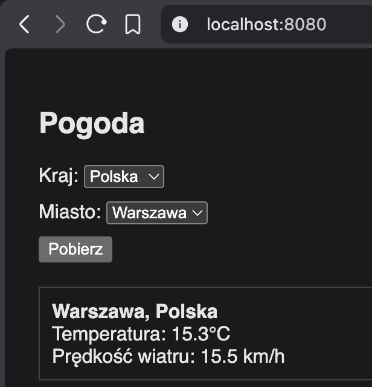
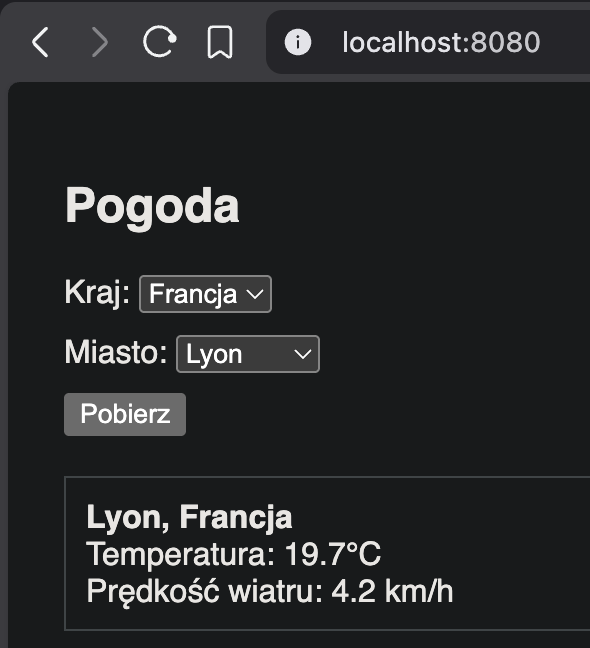

# Zadanie 1 

## 1. Kod aplikacji

### main.go
Aplikacja serwera HTTP w języku Go, obsługująca prosty interfejs pogodowy oraz mechanizm healthcheck.

```go
package main

import (
	"embed"
	"flag"
	"fmt"
	"html/template"
	"log"
	"net/http"
	"os"
	"time"
)

//go:embed templates/*
var content embed.FS

const (
	Author = "Adam Sidor"
	Port   = "8080"
)

func main() {
	// 1. Definicja flagi healthcheck
	isHealthCheck := flag.Bool("health", false, "Sprawdź stan serwera")
	flag.Parse()

	// 2. Logika Healthcheck: jeśli aplikacja jest uruchomiona z flagą -health
	if *isHealthCheck {
		// Próba połączenia z lokalnym serwerem
		client := http.Client{Timeout: 2 * time.Second}
		_, err := client.Get("http://localhost:" + Port)
		if err != nil {
			// Jeśli serwer nie odpowiada, kończymy z błędem (exit code 1)
			os.Exit(1)
		}
		// Jeśli odpowiedział, kończymy sukcesem (exit code 0)
		os.Exit(0)
	}

	// 3. Normalny start aplikacji (wyświetlanie logów przy starcie)
	startTime := time.Now().Format("2006-01-02 15:04:05")
	fmt.Printf("Data uruchomienia: %s\n", startTime)
	fmt.Printf("Autor programu:    %s\n", Author)
	fmt.Printf("Nasłuchiwanie na:  TCP %s\n", Port)

	// Parsowanie szablonów z osadzonego systemu plików
	tmpl, err := template.ParseFS(content, "templates/index.html")
	if err != nil {
		log.Fatal(err)
	}

	// Obsługa głównej strony
	http.HandleFunc("/", func(w http.ResponseWriter, r *http.Request) {
		tmpl.Execute(w, nil)
	})

	// Uruchomienie serwera
	serverErr := http.ListenAndServe(":"+Port, nil)
	if serverErr != nil {
		log.Fatal(serverErr)
	}
}
```

### index.html
Frontend aplikacji (znajdujący się w katalogu `templates/`).

```html
<!DOCTYPE html>
<html lang="pl">

<head>
    <meta charset="UTF-8">
    <meta name="viewport" content="width=device-width, initial-scale=1.0">
    <title>Pogoda</title>
    <style>
        body {
            font-family: sans-serif;
            padding: 20px;
        }

        .input-group {
            margin-bottom: 10px;
        }

        #result {
            margin-top: 20px;
            border: 1px solid #ccc;
            padding: 10px;
            display: none;
        }
    </style>
</head>

<body>

    <div class="card">
        <h2>Pogoda</h2>

        <div class="input-group">
            <label>Kraj:</label>
            <select id="country" onchange="updateCities()">
                <option value="Polska">Polska</option>
                <option value="Niemcy">Niemcy</option>
                <option value="Francja">Francja</option>
            </select>
        </div>

        <div class="input-group">
            <label>Miasto:</label>
            <select id="city"></select>
        </div>

        <button onclick="getWeather()">Pobierz</button>

        <div id="result">
            <strong id="res-city"></strong><br>
            Temperatura: <span id="res-temp"></span>°C<br>
            Prędkość wiatru: <span id="res-wind"></span> km/h
        </div>
    </div>

    <script>
        // Obiekt przechowujący dane o miastach (nazwy i współrzędne) pogrupowane według krajów
        const cityData = {
            "Polska": [
                { name: "Warszawa", coords: "52.2297,21.0122" },
                { name: "Kraków", coords: "50.0647,19.9450" },
                { name: "Wrocław", coords: "51.1079,17.0385" },
                { name: "Lublin", coords: "51.2465,22.5684" }
            ],
            "Niemcy": [
                { name: "Berlin", coords: "52.5200,13.4050" },
                { name: "Hamburg", coords: "53.5511,9.9937" },
                { name: "Monachium", coords: "48.1351,11.5820" }
            ],
            "Francja": [
                { name: "Paryż", coords: "48.8566,2.3522" },
                { name: "Marsylia", coords: "43.2965,5.3698" },
                { name: "Lyon", coords: "45.7640,4.8357" }
            ]
        };

        // Funkcja aktualizująca listę miast w zależności od wybranego kraju
        function updateCities() {
            // Pobranie wybranego kraju z dropdowna
            const country = document.getElementById('country').value;
            const citySelect = document.getElementById('city');

            // Wyczyszczenie aktualnej listy miast
            citySelect.innerHTML = "";

            // Dynamiczne dodawanie opcji miast dla wybranego kraju
            cityData[country].forEach(city => {
                const option = document.createElement('option');
                option.value = city.coords; // Wartością są współrzędne
                option.textContent = city.name;
                citySelect.appendChild(option);
            });
        }

        // Wywołanie funkcji przy załadowaniu strony, aby wypełnić listę dla domyślnego kraju
        updateCities();

        // Asynchroniczna funkcja pobierająca pogodę z API
        async function getWeather() {
            const citySelect = document.getElementById('city');
            if (!citySelect.value) return;

            // Rozdzielenie współrzędnych na szerokość i długość geograficzną
            const coords = citySelect.value.split(',');
            const cityName = citySelect.options[citySelect.selectedIndex].text;
            const countryName = document.getElementById('country').value;

            // Budowanie URL zapytania do API
            const url = `https://api.open-meteo.com/v1/forecast?latitude=${coords[0]}&longitude=${coords[1]}&current_weather=true`;

            try {
                // Wykonanie zapytania HTTP
                const response = await fetch(url);
                const data = await response.json();
                const weather = data.current_weather;

                // Wyświetlenie otrzymanych danych w sekcji wyników
                document.getElementById('res-city').innerText = `${cityName}, ${countryName}`;
                document.getElementById('res-temp').innerText = weather.temperature;
                document.getElementById('res-wind').innerText = weather.windspeed;
                document.getElementById('result').style.display = 'block';
            } catch (error) {
                // Obsługa błędu połączenia lub parsowania danych
                alert('Błąd podczas pobierania pogody.');
            }
        }
    </script>

</body>

</html>
```

## 2. Dockerfile

```dockerfile
# ETAP 1: Budowanie
FROM golang:1.22-alpine AS builder

# Instalacja certyfikatów CA dla zapytań HTTPS do API pogodowego
RUN apk add --no-cache ca-certificates

WORKDIR /app

# Pobieranie zależności
COPY go.mod ./
RUN go mod download || true

# Kopiowanie kodu źródłowego i plików statycznych
COPY . .

# Kompilacja statycznej binarki:
# CGO_ENABLED=0  -> wyłącza biblioteki dynamiczne C
# GOOS=linux     -> wymusza architekturę systemu Linux
# -ldflags="-s -w" -> usuwa tablice symboli i dane debugowania
# -o weather-app -> definiuje stałą nazwę pliku wyjściowego
RUN CGO_ENABLED=0 GOOS=linux go build -ldflags="-s -w" -o weather-app .

# ETAP 2: Finalny obraz 
FROM scratch

# Dane zgodnie ze standardem OCI
LABEL org.opencontainers.image.authors="Adam Sidor"

# Kopiowanie certyfikatów SSL i skompilowanej aplikacji
COPY --from=builder /etc/ssl/certs/ca-certificates.crt /etc/ssl/certs/
COPY --from=builder /app/weather-app /weather-app

# Informacja o porcie
EXPOSE 8080

# Healthcheck wykorzystujący mechanizm flag wbudowany w aplikację
HEALTHCHECK --interval=30s --timeout=3s --start-period=5s --retries=3 \
    CMD ["/weather-app", "-health"]

# Uruchomienie aplikacji
ENTRYPOINT ["/weather-app"]
```

## 3. Potrzebne polecenia

### a. Zbudowanie opracowanego obrazu kontenera
Aby zbudować obraz o nazwie `zadanie1`:
```bash
docker build -t zadanie1 .
```

### b. Uruchomienie kontenera na podstawie zbudowanego obrazu
Uruchomienie kontenera w tle z mapowaniem portu 8080:
```bash
docker run -d --rm -p 8080:8080 zadanie1
```

### c. Sposób uzyskania informacji z logów
Aby wyświetlić logi wygenerowane przez aplikację (np. datę uruchomienia, autora, port):
```bash
docker logs (ID_kontenera)
```

### d. Sprawdzenie liczby warstw oraz rozmiaru obrazu
Aby sprawdzić rozmiar obrazu:
```bash
docker images zadanie1
```

Aby sprawdzić liczbę warstw i szczegóły budowy obrazu:
```bash
docker history zadanie1
```

## 4. Logi z przebiegu prac

### a) Budowa obrazu
```bash
docker build -t zadanie1 .
[+] Building 284.7s (15/15) FINISHED                                                                                                                                                                                                                    docker:desktop-linux
 => [internal] load build definition from dockerfile                                                                                                                                                                                                                    0.0s
 => => transferring dockerfile: 1.26kB                                                                                                                                                                                                                                  0.0s
 => [internal] load metadata for docker.io/library/golang:1.22-alpine                                                                                                                                                                                                   4.6s
 => [auth] library/golang:pull token for registry-1.docker.io                                                                                                                                                                                                           0.0s
 => [internal] load .dockerignore                                                                                                                                                                                                                                       0.0s
 => => transferring context: 2B                                                                                                                                                                                                                                         0.0s
 => [builder 1/7] FROM docker.io/library/golang:1.22-alpine@sha256:1699c10032ca2582ec89a24a1312d986a3f094aed3d5c1147b19880afe40e052                                                                                                                                   266.8s
 => => resolve docker.io/library/golang:1.22-alpine@sha256:1699c10032ca2582ec89a24a1312d986a3f094aed3d5c1147b19880afe40e052                                                                                                                                             0.0s
 => => sha256:1699c10032ca2582ec89a24a1312d986a3f094aed3d5c1147b19880afe40e052 10.30kB / 10.30kB                                                                                                                                                                        0.0s
 => => sha256:7030196c59858ca8942e85aa2f68599240d58282ee35eb795609738a1e242c1f 1.92kB / 1.92kB                                                                                                                                                                          0.0s
 => => sha256:dc60353fc271af9976f3dac99fe351ce2471345b2ade8ee8acb70da6e39b99fe 2.10kB / 2.10kB                                                                                                                                                                          0.0s
 => => sha256:52f827f723504aa3325bb5a54247f0dc4b92bb72569525bc951532c4ef679bd4 3.99MB / 3.99MB                                                                                                                                                                         42.1s
 => => sha256:fa1868c9f11e67c6a569d83fd91d32a555c8f736e46d134152ae38157607d910 297.86kB / 297.86kB                                                                                                                                                                      2.2s
 => => sha256:90fc70e12d60da9fe07466871c454610a4e5c1031087182e69b164f64aacd1c4 66.29MB / 66.29MB                                                                                                                                                                      263.6s
 => => sha256:4861bab1ea04dbb3dd5482b1705d41beefe250163e513588e8a7529ed76d351c 127B / 127B                                                                                                                                                                              2.5s
 => => sha256:4f4fb700ef54461cfa02571ae0db9a0dc1e0cdb5577484a6d75e68dc38e8acc1 32B / 32B                                                                                                                                                                                2.9s
 => => extracting sha256:52f827f723504aa3325bb5a54247f0dc4b92bb72569525bc951532c4ef679bd4                                                                                                                                                                               0.1s
 => => extracting sha256:fa1868c9f11e67c6a569d83fd91d32a555c8f736e46d134152ae38157607d910                                                                                                                                                                               0.0s
 => => extracting sha256:90fc70e12d60da9fe07466871c454610a4e5c1031087182e69b164f64aacd1c4                                                                                                                                                                               3.0s
 => => extracting sha256:4861bab1ea04dbb3dd5482b1705d41beefe250163e513588e8a7529ed76d351c                                                                                                                                                                               0.0s
 => => extracting sha256:4f4fb700ef54461cfa02571ae0db9a0dc1e0cdb5577484a6d75e68dc38e8acc1                                                                                                                                                                               0.0s
 => [internal] load build context                                                                                                                                                                                                                                       0.0s
 => => transferring context: 16.01kB                                                                                                                                                                                                                                    0.0s
 => [builder 2/7] RUN apk add --no-cache ca-certificates                                                                                                                                                                                                                9.6s
 => [builder 3/7] WORKDIR /app                                                                                                                                                                                                                                          0.0s 
 => [builder 4/7] COPY go.mod ./                                                                                                                                                                                                                                        0.0s 
 => [builder 5/7] RUN go mod download || true                                                                                                                                                                                                                           0.1s 
 => [builder 6/7] COPY . .                                                                                                                                                                                                                                              0.0s
 => [builder 7/7] RUN CGO_ENABLED=0 GOOS=linux go build -ldflags="-s -w" -o weather-app .                                                                                                                                                                               3.5s
 => [stage-1 1/2] COPY --from=builder /etc/ssl/certs/ca-certificates.crt /etc/ssl/certs/                                                                                                                                                                                0.0s
 => [stage-1 2/2] COPY --from=builder /app/weather-app /weather-app                                                                                                                                                                                                     0.0s
 => exporting to image                                                                                                                                                                                                                                                  0.0s
 => => exporting layers                                                                                                                                                                                                                                                 0.0s
 => => writing image sha256:409d44afab6ac4a8757701ca93d343041cb32f2a80ac070ebcf69747426f5c3f                                                                                                                                                                            0.0s
 => => naming to docker.io/library/zadanie1                                                                                                                                                                                                                             0.0s
```

### b) Uruchomienie kontenera
```bash
docker run -d --rm -p 8080:8080 zadanie1
93a6df0bd21bf30709eaefd68bfc4be263cfb45eae91466bac161742f9956a53
```

### c) Stan kontenera (Healthcheck)
```bash
docker ps
CONTAINER ID   IMAGE      COMMAND          CREATED         STATUS                   PORTS                                         NAMES
93a6df0bd21b   zadanie1   "/weather-app"   3 minutes ago   Up 3 minutes (healthy)   0.0.0.0:8080->8080/tcp, [::]:8080->8080/tcp   zen_easley
```

### d) Logi aplikacji
```bash
docker logs 93a6df0bd21b
Data uruchomienia: 2026-04-22 14:51:17
Autor programu:    Adam Sidor
Nasłuchiwanie na:  TCP 8080
```

### e) Rozmiar obrazu
```bash
docker images zadanie1
IMAGE             ID             DISK USAGE   CONTENT SIZE   EXTRA
zadanie1:latest   409d44afab6a        7.3MB             0B    U
```

### f) Historia warstw obrazu
```bash
docker history zadanie1
IMAGE          CREATED         CREATED BY                                      SIZE      COMMENT
409d44afab6a   6 minutes ago   ENTRYPOINT ["/weather-app"]                     0B        buildkit.dockerfile.v0
<missing>      6 minutes ago   HEALTHCHECK &{["CMD" "/weather-app" "-health…"  0B        buildkit.dockerfile.v0
<missing>      6 minutes ago   EXPOSE [8080/tcp]                               0B        buildkit.dockerfile.v0
<missing>      6 minutes ago   COPY /app/weather-app /weather-app              7.08MB    buildkit.dockerfile.v0
<missing>      6 minutes ago   COPY /etc/ssl/certs/ca-certificates.crt /etc…   223kB     buildkit.dockerfile.v0
<missing>      6 minutes ago   LABEL org.opencontainers.image.authors=Adam …   0B        buildkit.dockerfile.v0
```

### g) Zrzuty ekranu działającej aplikacji

